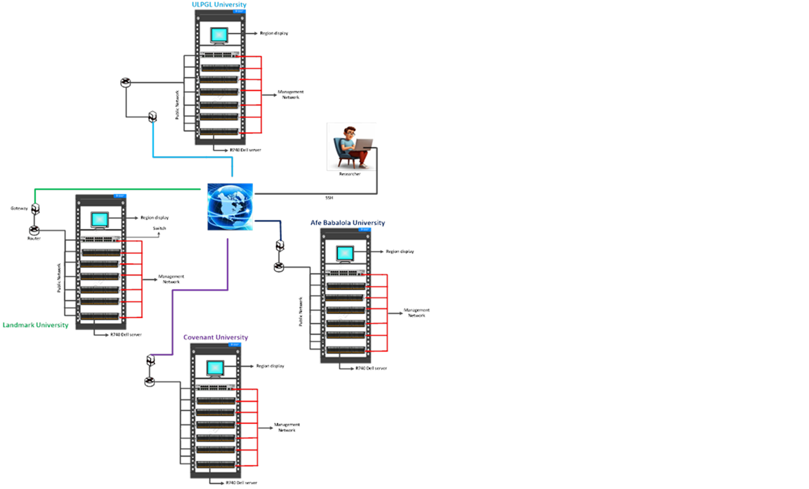

FEDGEN Testbed Layout
--------------------

The FEDGEN Cloud Testbed is a federation made up of four (4) interconnected computing node located at Covenant University, Landmark University, Afe Babalola University, and UGLPA University in Democratic Republic of Congo (DRC). Each computing node/region consists of six (6) Dell Powered Edge R740 and R750 servers. In a typical workflow, users get connected to their FEDGEN cloud testbed resource through ssh. The Testbed layout is shown in the diagram below.

|FEDGEN HPC Flow|

Servers
===========
The federated testbed computational resources are Dell R740 and R750 powered edge servers. The specifications of the servers are shown in the Table 1 below.

Switch
===============
Cisco 2900 series switches are employed for connecting the servers. The switches have 1Gbps and 10Gbps ports. The servers are connected to public and local networks using the Virtual Local Area Network (VLAN) on the switch.

Display
=================
Each region is equipped with a Dell display to enable effective troubleshooting and maintenance.

Routers
==============
Each region is equipped with a Cisco router for connectivity and access of resources on the cloud testbed

